# Study Organizer – Django Web Application


## Overview

Study Organizer is a web application built with the Django framework that helps students manage their academic
activities. The application allows users to organize courses, schedule lectures, and track tasks with deadlines.

The project demonstrates the use of Django models, forms, class-based views, template inheritance, and PostgreSQL
integration.

The goal of the application is to provide a simple and structured way to keep track of academic responsibilities in one
place.

---

# Application Screenshots

## Home Page

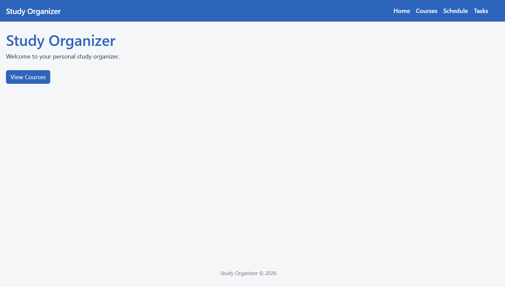

The home page introduces the application and provides quick navigation to the main modules.

---

# Courses Module

## Courses Page

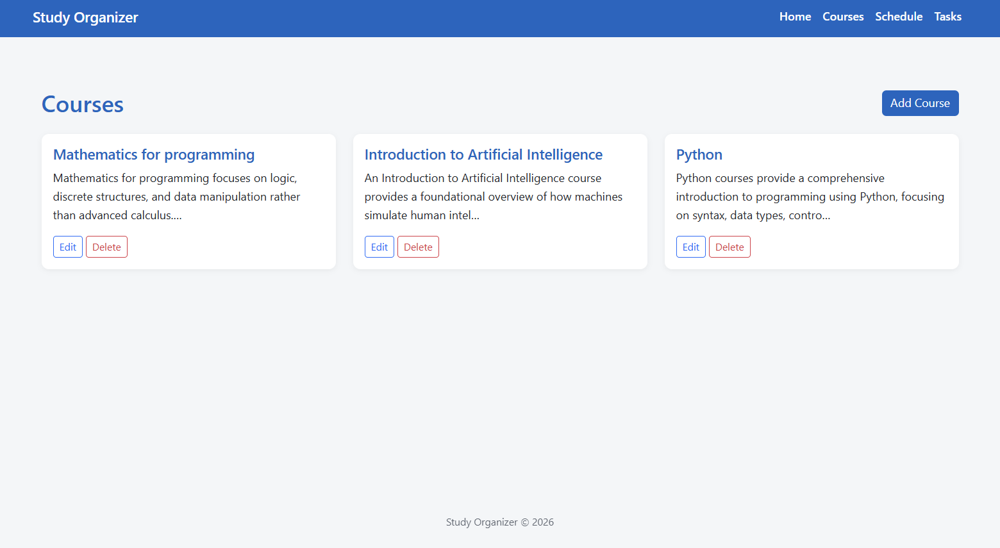

The Courses page allows users to manage all courses in the system.

Features:

- View all courses displayed as Bootstrap cards
- Add new courses
- Edit course information
- Delete courses with confirmation

This module demonstrates full **CRUD functionality** for the Course model.

---

## Create Course

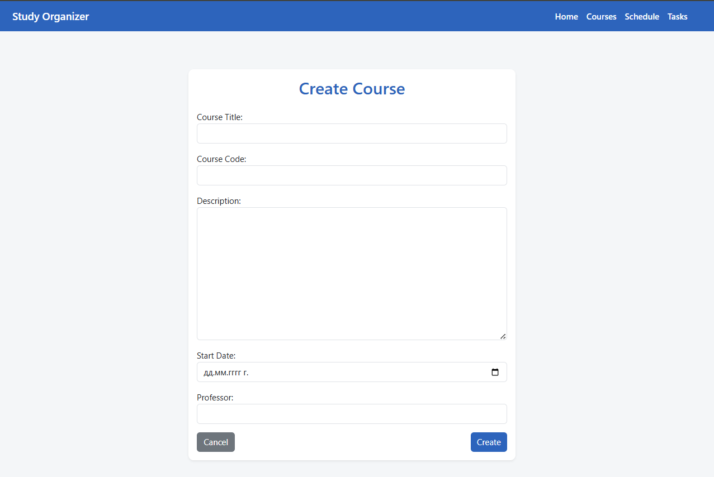

Users can create a new course by providing:

- Course title
- Unique course code
- Description
- Start date
- Professor name

The form uses custom widgets and Bootstrap styling.

---

## Edit Course

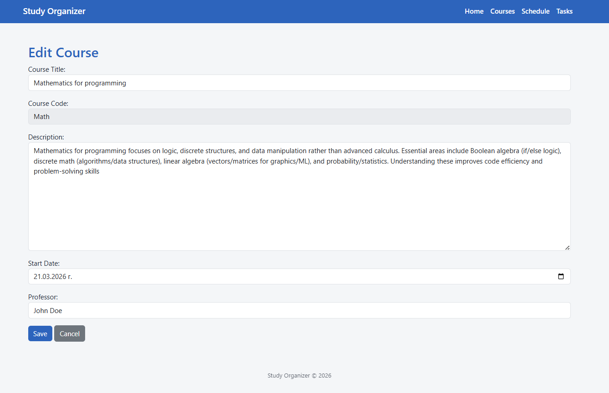

Existing courses can be updated.

Important behavior:

- The **Course Code field becomes read-only after creation** to preserve the course identity.

---

## Delete Course

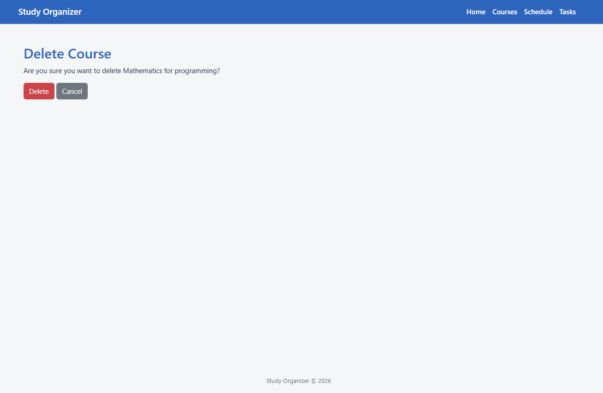

Courses can be removed from the system through a confirmation page to prevent accidental deletion.

---

# Schedule Module

## Schedule Page

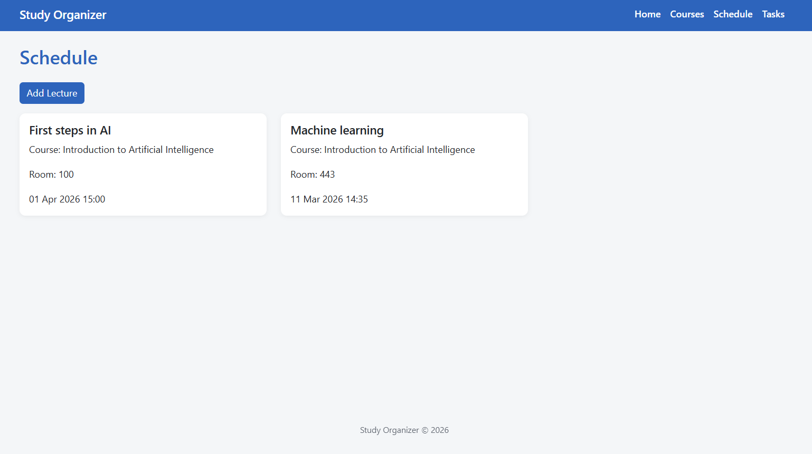

The Schedule module manages lectures associated with courses.

Features:

- View all scheduled lectures
- Each lecture displays:
    - Lecture title
    - Associated course
    - Room number
    - Date and time
- Add new lectures linked to a course

This module demonstrates a **many-to-one relationship between Lecture and Course**.

---

## Add Lecture

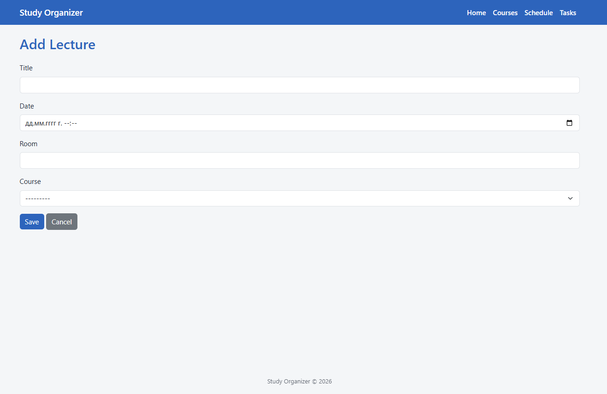

Users can add lectures to a course using a simple form where they provide:

- Lecture title
- Date and time
- Room number
- Associated course

The course field can be automatically pre-filled when adding a lecture from a course page.

---

# Tasks Module

## Tasks Page

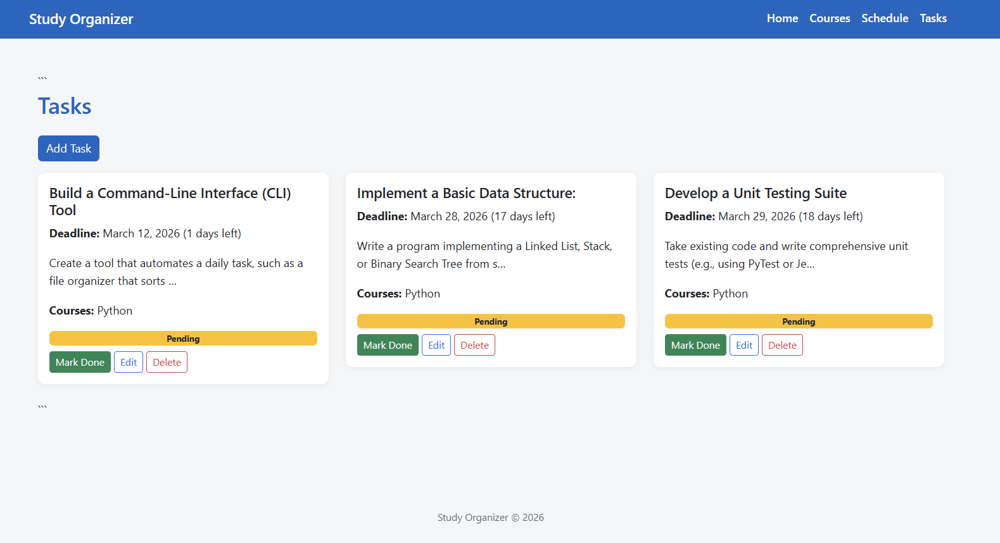

The Tasks module allows users to manage assignments and deadlines.

Features:

- Create tasks associated with one or more courses
- Display task descriptions and deadlines
- Automatically calculate **remaining days until the deadline**
- Mark tasks as completed or pending
- Edit or delete tasks

A progress bar visually indicates task completion.

This module demonstrates a **many-to-many relationship between Task and Course**.

---

## Mark Task as Done

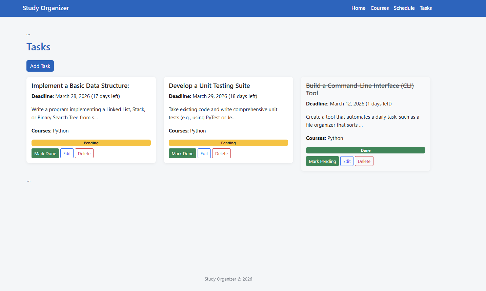

Tasks can be marked as completed using the **Mark Done** button.

When completed:

- The progress bar turns green
- The task status changes to **Done**
- The button toggles to **Mark Pending**

---

## Edit Task

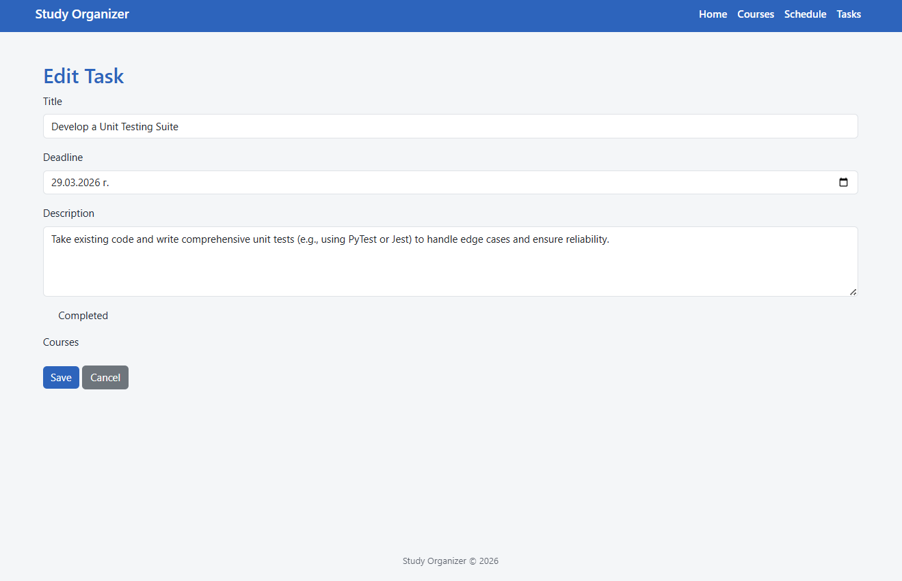

Tasks can be edited to update:

- Title
- Description
- Deadline

This allows users to keep their tasks up to date.

---

## Delete Task

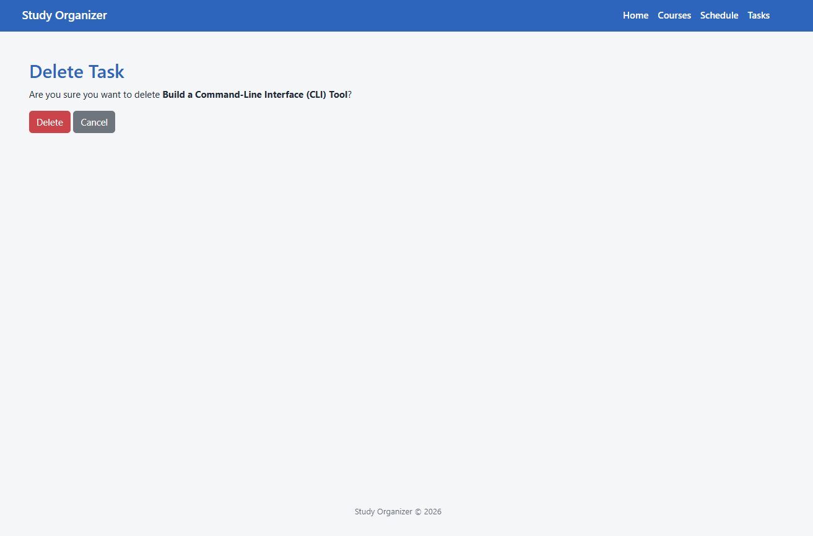

Tasks can be removed from the system through a confirmation page to prevent accidental deletion.

---

# Features

* Manage university **courses**
* Schedule **lectures** associated with courses
* Create and track **tasks and deadlines**
* Mark tasks as completed
* Automatically display remaining days until a task deadline
* Custom **404 error page**
* Responsive interface using **Bootstrap**
* Clean navigation between all pages

---

# Project Structure

The application is organized into three Django apps:

* **courses** – manages course information
* **schedule** – handles lectures and lecture scheduling
* **tasks** – manages assignments and deadlines

---

# Database

The project uses **PostgreSQL** as the database management system.

PostgreSQL is run inside a **Docker container** for easier setup and portability.

---

# Technologies Used

* Python
* Django
* PostgreSQL
* Docker
* Bootstrap
* HTML / CSS

---

# Installation

## 1. Clone the repository

```bash
git clone https://github.com/Mario8802/study_organizer.git
cd study_organizer
```

---

## 2. Create a virtual environment

```bash
python -m venv .venv
```

### Activate the environment

**Windows**

```bash
.venv\Scripts\activate
```

**Mac / Linux**

```bash
source .venv/bin/activate
```

---

## 3. Install dependencies

```bash
pip install -r requirements.txt
```

---

## 4. Start PostgreSQL using Docker

```bash
docker run -d -p 5432:5432 \
-e POSTGRES_DB=study_organizer_db \
-e POSTGRES_USER=postgres \
-e POSTGRES_PASSWORD=postgres \
--name study_postgres postgres
```

---

## 5. Apply database migrations

```bash
python manage.py migrate
```

---

## 6. Create admin user (optional)

```bash
python manage.py createsuperuser
```

---

## 7. Run the development server

```bash
python manage.py runserver
```

Open the application in your browser:

```
http://127.0.0.1:8000/
```

---

# Custom Functionality

The application includes several custom features required for the project:

- Custom form validation
- Custom template filter for displaying remaining days until a deadline
- Disabled form fields
- Delete confirmation pages
- Bootstrap styled forms
- Custom 404 error page

---

# Notes

Authentication and Django user management are intentionally excluded, as required by the project specification.

---

# Author

Project developed as part of the **Django Web Development coursework at SoftUni**.